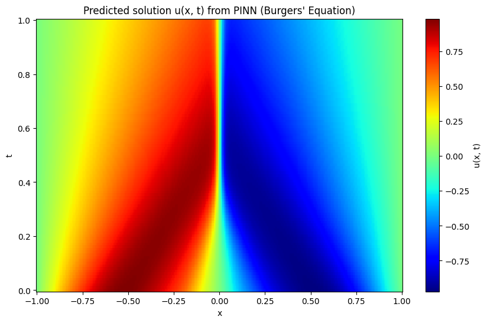
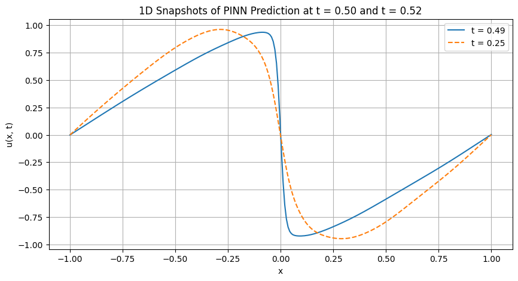

<!-- MathJax Script -->

# Physics-Informed Neural Networks

As a first step in learning machine learning techniques related to physics, I decided to read this foundational and original paper on Physics-Informed Neural Networks (PINNs). Its implementation is relatively simple, making it a good starting point for beginners. In this post, I’ll walk through how PINNs integrate physical laws into neural networks from the perspective of someone new to the field, based on what I learned from the paper. My implementation can be viewed from this link: [View Implementation](https://github.com/skato-kx/skato-kx.github.io-pinn-research-)

## 🔗 Paper Info

- **Title**: [Physics Informed Deep Learning (Part I): Data-driven Solutions of Nonlinear Partial Differential Equations](https://arxiv.org/abs/1711.10561)
- **Authors**: Maziar Raissi, Paris Perdikaris, George Em Karniadakis
- **Keywords**: PINN, PDE, Deep Learning, Physics-based ML

## 🧠 What is NN?

A neural network is generally a system that learns patterns from past data in order to make predictions or classifications. More specifically, it learns the relationship between an input $x$ and an output $u$ by observing many examples. During training, the network predicts a value of $u$ for a given $x$, compares it to the true (ground truth) value, and then adjusts its internal parameters—across many interconnected neurons—to minimize the error between the prediction and the truth. This iterative process is what constitutes the typical learning mechanism of a neural network.

## 🧠 Why PINN?

However, when the target of prediction is a complex physical phenomenon, it's often difficult—or even impossible—to obtain the true values of $u$. In such cases, there may not be enough data available, making it hard for a standard neural network to learn effectively. This is where Physics-Informed Neural Networks (PINNs) come in. Instead of relying solely on data, PINNs incorporate physical laws—specifically, partial differential equations (PDEs)—into the training process, allowing the network to learn in a more principled and constrained way.

## 🔍 What is a PDE?

In the context of PINNs, a **partial differential equation (PDE)** represents a fundamental physical law—one that governs the behavior of systems in our universe. These equations are considered to hold true at all times, regardless of the specific situation. That said, the **form of the PDE stays the same**, but the **functions contained within it—especially the solution function $u$**—**depend on the specific physical scenario**. The role of the PINN is to approximate this function $u$, which varies from case to case.

To illustrate with a simple analogy: the equation $F = ma$ is always valid as a law of motion. But the specific values of $F$, $m$, and $a$ depend on the object or system being studied. Similarly, in a PDE, the general law is fixed, but the solution function $u$ changes depending on the particular problem.

From a beginner's perspective, this idea can be a little confusing—I also found myself stumbling over it at first. But once you realize that the PDE itself provides the **rules**, and $u$ is the **unknown function you're trying to find**, the overall framework of PINNs becomes much clearer.

## Two Types of Approaches

PINNs can be broadly categorized into two types of approaches depending on how they treat time: continuous-time models and discrete-time models. Below, I’ll briefly explain how each of them works.

## Continuous-Time Models

In this approach, the governing PDE can be rewritten into the general form:  
$u_t + \mathcal{N}[u; \lambda] = 0$,  
where $u$ is the solution, $x$ and $t$ are the space and time variables, and $\lambda$ represents known parameters. All components of this equation—time derivatives, spatial derivatives, and other terms—can be expressed in terms of the predicted function $u(x,t)$ and its derivatives.

While this might sound abstract at first, the key idea is simple: since every PDE is, by definition, an equation, we can always rearrange it to isolate everything on one side and set the equation equal to zero—i.e., something = 0. This "something" can be calculated as long as we know the input variables $x$ and $t$, and the predicted output $u$ from the neural network.

So, by feeding arbitrary values of $x$ and $t$ into the network and computing this residual term, we can use it directly as part of the loss function. In other words, the network is trained not by minimizing the difference between predicted and ground-truth data, but by minimizing the violation of the physical law itself. This allows us to train a neural network without requiring labeled data, as long as we know the governing PDE.

In practice, PINNs don't rely solely on the PDE residual. The loss function typically combines **multiple components**: a small amount of supervised data (when available), as well as terms that enforce **initial conditions** and **boundary conditions**, which are essential in physical problems. These components are all summed together to form the total loss, and the neural network is trained to minimize this combined value—effectively learning a solution that satisfies the governing PDE, adheres to the physical constraints, and fits any available data.

## 🧾 Example: Applying PINNs to Burgers' Equation

Here, we illustrate the method using the **Burgers' equation** as an example. This equation is used in the original PINNs paper, and I also used it in my own implementation. It represents a physical law that describes **nonlinear convection and diffusion phenomena**, and is written as:

$$
\frac{\partial u}{\partial t} + u \frac{\partial u}{\partial x} = \nu \frac{\partial^2 u}{\partial x^2}
$$

This can be rewritten in the general form used in the PINNs framework:

$$
u_t + \mathcal{N}[u; \lambda] = 0
$$

In the case of the Burgers' equation, this becomes:

$$
\frac{\partial u}{\partial t} + u \frac{\partial u}{\partial x} - \nu \frac{\partial^2 u}{\partial x^2} = 0
$$

At this point, we define the **left-hand side** of the equation as a new function:

$$
f(x, t) := \frac{\partial u}{\partial t} + u \frac{\partial u}{\partial x} - \nu \frac{\partial^2 u}{\partial x^2}
$$

By computing this function $f$ using the output $u(x, t)$ from the neural network and its derivatives (obtained via autograd), we can incorporate it into the loss function. The model is then trained to minimize this residual — that is, to make $f(x, t) \approx 0$ at all sampled collocation points.

## Discrete-Time Models

As mentioned earlier, continuous-time models take both spatial and temporal variables—$x$ and $t$—as inputs to the neural network. While this provides a flexible way to model physical systems, it can lead to a significant increase in the number of training points, especially when time is finely sampled.

To alleviate this, an alternative approach called the **discrete-time model** has been proposed. This approach leverages a technique called the **Runge-Kutta (RK) method**, which is a technique for approximating equations that include time derivatives—such as PDEs—using discrete time steps. Instead of treating time as a continuous input, the time interval from $t_n$ to $t_{n+1}$ is divided into several smaller stages of duration $\Delta t$.

Since the target function $u$ depends on time, its value naturally changes across these stages. However, using the RK method, each stage’s value of $u$ can be approximated based on the value at $t_n$, denoted as $u_n$. Without going into the exact equations, the key idea is that we can ask the neural network to predict the values of $u$ at each intermediate stage. Then, based on these predicted stage values, we can reconstruct several approximations of $u_n$.

If the network’s predictions are truly consistent with the underlying PDE, **all of these reconstructed $u_n$ values should agree**—they should be equal. Therefore, we define a loss term that measures the **discrepancy among these multiple reconstructions**, and train the network to minimize this discrepancy.

Of course, as with the continuous-time models, the total loss function in this case also includes terms for supervised data (when available), as well as for initial and boundary conditions. All of these components are combined to guide the network toward solutions that are not only consistent with the discretized PDE, but also respect the physical constraints and any known data.

## 🛠️ Implementation

`continuous_time_model.ipynb` contains an implementation of a continuous-time PINN model based on the Burgers' equation.

## 📊 Results

This is a heatmap of the solution $u(x, t)$, where the horizontal and vertical axes represent space $x$ and time $t$, respectively. We can observe that the initial sine wave becomes sharper over time, with the peak concentrating near the center at $x = 0$.

The following plots show $u$ versus $x$ at two fixed time steps, $t = 0.25$ and $t = 0.5$. These also indicate that the wave becomes steeper near the center as time progresses.

Overall, the results closely match those shown in the original paper and align well with the expected behavior of the Burgers' equation (PDE). This demonstrates that the model has successfully learned the correct dynamics, and the implementation is working as intended.

## 💭 Final Thoughts & Reflections

This paper illustrates how Physics-Informed Neural Networks (PINNs) can offer data-driven solutions to problems governed by physical laws. It presents various approaches, such as those described above, and goes further into details that I haven't covered here—such as specific PDE examples, how they are reformulated for PINNs, and how the loss functions are constructed in combination with initial and boundary conditions, depending on the physical phenomena being modeled.

What I personally found most fascinating was how the mathematical and physical knowledge that I had previously treated as abstract, test-oriented content suddenly became practical and meaningful within the context of machine learning. This experience has made me eager to explore more techniques in physics-related machine learning, and to better understand how these fundamental principles can be applied in real-world modeling.
